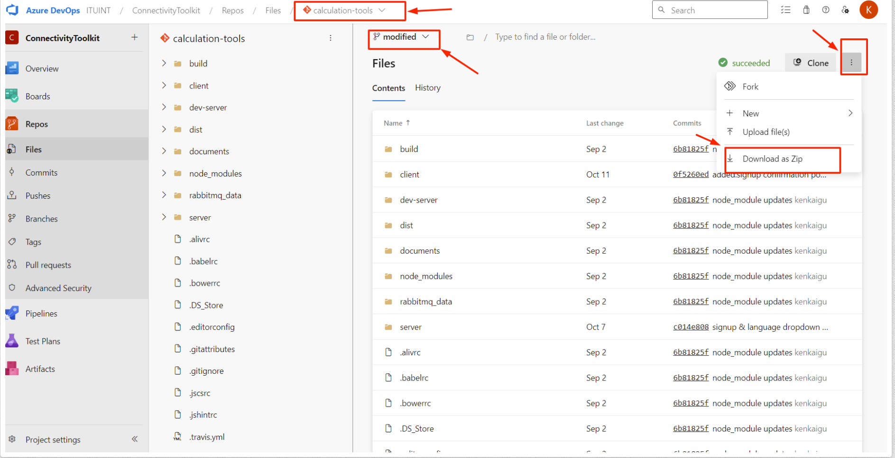

# Calculation Tools Setup Guide

This guide will walk you through setting up the frontend, backend, and database for the Calculation Tools project. Follow the steps in sequence for a smooth installation. 

This setup assumes you have **Php 7.4 +, python 3+ and node20+  installed successfully** from the previous prerequisites step

---

### **Project stack on modified version:**

* **Frontend** : Based on Angular (old version).
* **Backend** : PHP (using Slim Framework).
* **Database** : MySQL (via XAMPP).

**To setup the following tools needed for this project**  , use this [Setup guide](/calculation-tools_documentation/modified_version/prerequisites/ "Setup guide for the modified version")

**To understand how xampp works , have a look at this guide** [Xampp guide](https://phpandmysql.com/extras/installing-xampp/#why-use-xampp)

---

**VIDEOS**

Use this video link to view how to set up the project: [Modified toolkit installation &amp; setup video](https://ituint.sharepoint.com/:f:/r/sites/UIUXandFrontEnd/Shared%20Documents/General/Modified%20toolkit%20installation%20%26%20setup%20video?csf=1&web=1&e=fAnKNZ)

Use this video to understand how Xampp server works for local setups  [Xampp guide and setup video](https://www.youtube.com/watch?v=GRqw0pBwewY)

## **Downloading the project :**

You can clone the modified branch by going to this link : [https://ITUINT@dev.azure.com/ITUINT/ConnectivityToolkit/_git/calculation-tools]()  But its much easier for you if you just download the zip version . **Downloading saves you time and less setup** 



After downloading, you can proceed with the steps below 

## **Step 1: Frontend Setup**

### **1.1 Install Node.js and NPM**

* Ensure you have **Node.js** and **npm** installed. You can download the latest version from [Node.js Official Website](https://nodejs.org/).
* **Verify the installation** by running the following commands:

  node -v

  npm -v

### **1.2 Install Gulp Globally and Locally**

* Install the **Gulp CLI globally** to ensure you can run the `gulp` commands across your system:

  ```
  npm install --global gulp-cli@2.3.0
  ```
* Install **Gulp locally** in your project directory:

  ```
  npm install gulp@4.0.2 --save-dev
  ```
* **Verify Gulp installation** :

  ```
  gulp --version
  ```

  The output should show:

  * **CLI version** : 2.3.0
  * **Local version** : 4.0.2

### **1.3 Install Frontend Dependencies**

* Navigate to the project root (where `package.json` is located), and install the necessary Node and Bower packages:

  npm install

  bower install

  If you encounter issues with dependencies, you may need to clear the `node_modules` folder and reinstall:

  rm -rf node_modules

  npm install

### **1.4 Serve the Frontend**

* Use **Gulp** to serve the application:

  ```
  gulp serve
  ```
* The frontend will be served on `http://localhost:8000`

---

## **Step 2: Backend Setup**

### **2.1 Install Composer**

* Make sure **Composer** is installed for managing PHP dependencies. If not, download and install it from [Composer&#39;s Official Website](https://getcomposer.org/).
* If you run into compatibility issues with PHP versions, use the `ignore-platform-reqs` flag:

  ```
  composer install --ignore-platform-reqs
  ```

### **2.2 Install Backend Dependencies** 

* Navigate to the `server` directory (where the backend code resides) and install the required PHP dependencies using Composer:

  ```
  cd server
  ```

  ```
  php composer.phar install --ignore-platform-reqs
  ```

### **2.3 Check Backend Configuration**

* Verify the database configuration in the `app/settings.php` file and ensure the correct database credentials are entered. Use the following configuration for XAMPP:

  ```php
  'db' => [
      'host' => '127.0.0.1',
      'port' => '3306', // XAMPP default MySQL port
      'dbname' => 'giga',
      'user' => 'root',
      'pass' => '' // No password for XAMPP's default MySQL setup
  ],
  ```

### **2.4 Start the Backend Server**

* To start the backend server, run the following command from the `server` directory:

  ```
  php composer.phar start
  ```
* The backend will be available at `http://localhost:8080`.

---

## **Step 3: Database Setup ** This assumes you are using XAMPP, and you are running Apache and mysql

Ensure that you have xampp installed. To run it, double click on the xampp icon to open xampp control panel, then
start apache and mysql   [Use this guide for more help with XAMPP ](https://www.youtube.com/watch?v=2ynKAAt1G4Y)

### **3.1 Access phpMyAdmin**

* Go to your browser and type `http://localhost/phpmyadmin` to access the MySQL administration interface.

### **3.2 Create the Database**

* In **phpMyAdmin**, click on the **Databases** tab.
* Create a new database with the following details:
  * **Database name** : `giga`
  * **Username** : `root`
  * **Password** : Leave it blank (default for XAMPP).

### **3.3 Upload the Database**

* Download the SQL file from the following link: [Download giga.sql](https://github.com/FNS-Division/calculation-tools_documentation/blob/main/giga.sql).
* In phpMyAdmin, select the `giga` database and click on the **Import** tab.
* Choose the `giga.sql` file you downloaded and click **Go** to upload the database schema.

---

## **Step 4: Verify Database Connection**

### **4.1 Edit the Database Connection File**

* Open the `app/settings.php` file.
* Ensure the database connection settings match the following configuration for XAMPP:

  ```php
  'db' => [
      'host' => '127.0.0.1',
      'port' => '3306', // XAMPP default MySQL port
      'dbname' => 'giga',
      'user' => 'root',
      'pass' => '' // No password for XAMPP's default MySQL setup
  ],
  ```

### **4.2 Test Admin Login**

* After setting up the database and ensuring the connection is configured correctly, try logging into the system using the following credentials:
  * **Email** : `admin@itu.int`
  * **Password** : `AdminTools123!`
* If the setup is correct, you should be able to log in successfully as **super admin**.

---

## **Step 5: Final Checks**

* Ensure the frontend and backend servers are both running:
  * **Frontend** : Available at `http://localhost:8000`.
  * **Backend** : Available at `http://localhost:8080`.
* Verify that the database connection is functioning properly and that you can log in to the system using the provided credentials.
