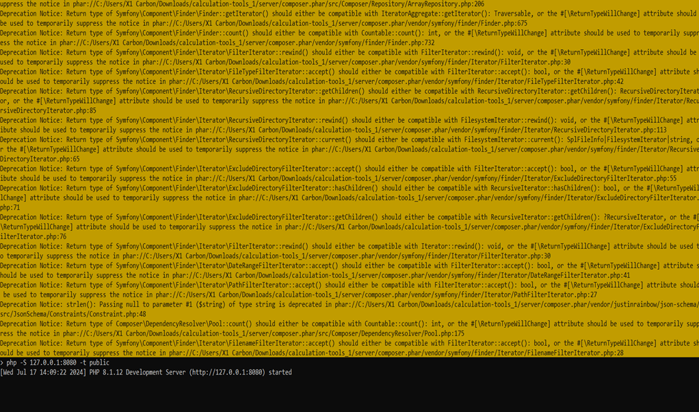

# Calculation Tools Setup Guide (Old Version)

This guide provides step-by-step instructions for setting up the **old version of the Calculation Tools**, both on the client side and the server side.

There are 2 sides to this setup:

- **Client-side setup**
- **Server-side setup**
- **Database Setup**

> **GETTING STARTED**:

```
git clone https://ITUINT@dev.azure.com/ITUINT/ConnectivityToolkit/_git/calculation-tools
```

---

## Client-Side Setup

Follow these steps to set up the client side of the project:

### Summary

1. Navigate to the project root.
2. Install required packages: `npm install && bower install`
3. Start the application server: `gulp serve`

### Prerequisites

*For this to load successfully, ensure the following:*

#### 1. Switch to Node.js Version 10

Ensure that Node.js version 10 is active in your environment:

```
nvm use 10
```

#### 2. Confirm the Active Node.js Version

Verify that Node.js version 10.x.x is active by running:

```
node -v
```

Ensure the output shows `v10.x.x`.

#### 3. Install Required Packages

Install the necessary packages for the project:

```
npm install && bower install
```

#### 4. Handling Gulp-Related Issues

If you encounter issues related to Gulp during installation, particularly with Babel and ES6, refer to the following guide to resolve them:
[Using ES6 with Gulp](https://markgoodyear.com/2015/06/using-es6-with-gulp/)

After this fix (if you encounter it), confirm if Gulp is set by typing:

```
gulp -v
```

#### 5. Start the Development Server

Once everything is set up, start the development server using Gulp:

```
gulp serve
```

### Important Notes:

- **Node Version**: Ensure that any new terminal you open for this project uses Node.js version 10.
- **Administrator Mode**: Run CMD in administrator mode, especially if you're on Windows 11, to avoid permission issues.

---

### Screenshots

*This part takes some bit of time, & you will encounter warnings and some light JS errors, but let it process and load till the end.*


---

## Server-Side Setup

Setting up the server side of the project involves configuring PHP and Python and running the necessary commands to start the local server.

### Summary

Required: Docker, RabbitMQ
Recommended PHP version: *5.6.25+*
Recommended NodeJS version: *7.9.0+* with NPM *4.2.0+*

Setting up PHP API server:

1. Navigate to the **server** directory.
2. Install required packages: `php composer.phar install`
3. Start local server: `php composer.phar start`

### Prerequisites

*For this to load successfully, ensure the following:*

#### 1. Access the Server Directory

Open a new CMD terminal in administrator mode, and navigate to the server directory within the project:

```
cd path\to\your\project\server
```

Example:

```
C:\Users\X1 Carbon\Downloads\calculation-tools_1>cd server
```

#### 2. Confirm Versions

Before proceeding, ensure that the following versions are active:

- **PHP Version**: At least 7.3 (using PHP 8.1.12 with XAMPP). Download XAMPP from [Apache Friends](https://www.apachefriends.org/download.html).
- **Python Version**: Python 2.7. Download it from [Python.org](https://www.python.org/downloads/release/python-272/).
- **Node.js Version**: Ensure Node.js version 10.24.0 is active.

#### 3. Install Required Packages

Install the necessary packages for the server side using Composer:

```
php composer.phar install
```

#### 4. Start the Local Server

Once the packages are installed, start the local server:

```
php composer.phar start
```

### Notes:

- **Errors and Warnings**: You may encounter a long list of errors and warnings during the server startup, but the server should still run successfully.

---

### Screenshots

*This part takes some bit of time, & you will encounter warnings and some light JS errors, but let it process and load till the end.*





---


## Database Setup  ( This assumes you are using XAMPP, and you are running Apache and mysql )

Ensure that you have xampp installed. To run it, double click on the xampp icon to open xampp control panel, then
start apache and mysql   [Use this guide for more help with XAMPP ](https://www.youtube.com/watch?v=2ynKAAt1G4Y)

### **3.1 Access phpMyAdmin**

* Go to your browser and type `http://localhost/phpmyadmin` to access the MySQL administration interface.

### **3.2 Create the Database**

* In **phpMyAdmin**, click on the **Databases** tab.
* Create a new database with the following details:
  * **Database name** : `giga`
  * **Username** : `root`
  * **Password** : Leave it blank (default for XAMPP).

### **3.3 Upload the Database**

* Download the SQL file from the following link: [Download giga.sql](https://github.com/FNS-Division/calculation-tools_documentation/blob/main/giga.sql).
* In phpMyAdmin, select the `giga` database and click on the **Import** tab.
* Choose the `giga.sql` file you downloaded and click **Go** to upload the database schema.

---

## **Step 4: Verify Database Connection**

### **4.1 Edit the Database Connection File**

* Open the `app/settings.php` file.
* Ensure the database connection settings match the following configuration for XAMPP:

  ```php
  'db' => [
      'host' => '127.0.0.1',
      'port' => '3306', // XAMPP default MySQL port
      'dbname' => 'giga',
      'user' => 'root',
      'pass' => '' // No password for XAMPP's default MySQL setup
  ],
  ```

### **4.2 Test Admin Login**

* After setting up the database and ensuring the connection is configured correctly, try logging into the system using the following credentials:
  * **Email** : `admin@itu.int`
  * **Password** : `AdminTools123!`
* If the setup is correct, you should be able to log in successfully.

---

## **Step 5: Final Checks**

* Ensure the frontend and backend servers are both running:
  * **Frontend** : Available at `http://localhost:8000`.
  * **Backend** : Available at `http://localhost:8080`.
* Verify that the database connection is functioning properly and that you can log in to the system using the provided credentials.

---

**End of Guide**
